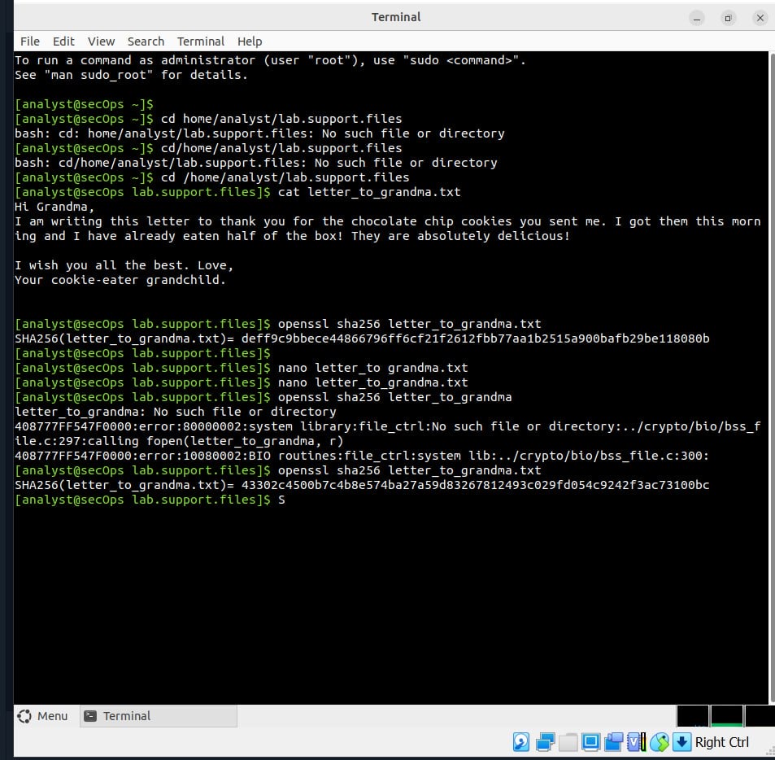
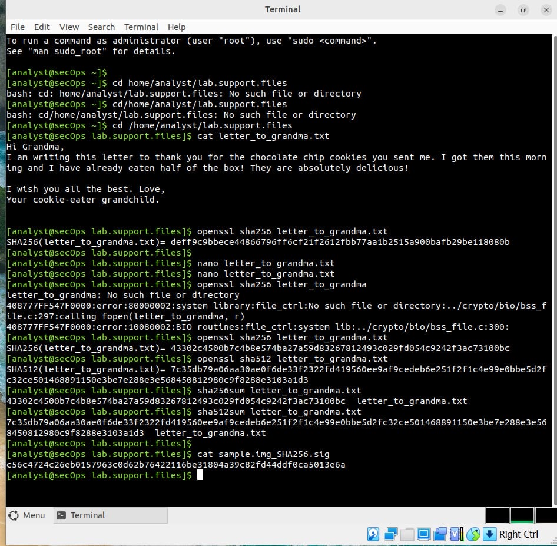
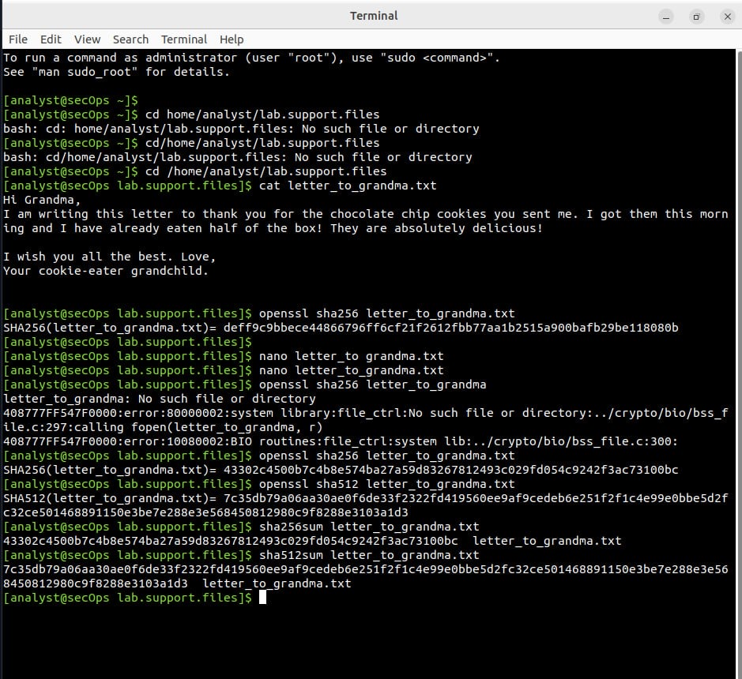

# Lab Evidence: Hashing & Data Integrity
**Project:** Cisco CyberOps Associate Lab

This folder contains the technical documentation and visual evidence for my Data Integrity lab. I used the Cisco CyberOps VM to demonstrate how hashing algorithms detect even the smallest changes in data.

## 📁 Lab Documentation
* **[Final Lab Report (PDF)](./Data-integrity-hashing-lab.pdf)** > *Note: My analysis and verified results are documented in **Bold Green**.*

---

## 📸 Technical Evidence

### 1. The Avalanche Effect
In this test, I modified a single character in a text file. This screenshot shows how the MD5 hash signature completely transformed, demonstrating the "Avalanche Effect."

### 2. SHA-256 Verification
I generated a SHA-256 hash for a downloaded file. By matching this signature against the provided hash, I verified that the file was 100% authentic and uncorrupted.

### 3. Cross-Tool Consistency
Using `OpenSSL` and native Linux checksum tools to confirm that the hashing results remain consistent across different security utilities.

---
**Environment:** Cisco CyberOps VM (Linux)  
**Algorithms Used:** MD5, SHA-256  
**Tools:** `openssl`, `sha256sum`, `nano`

